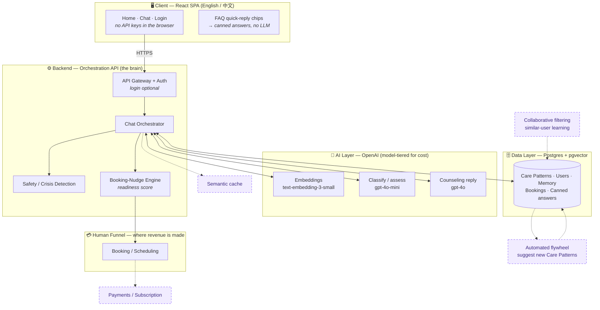
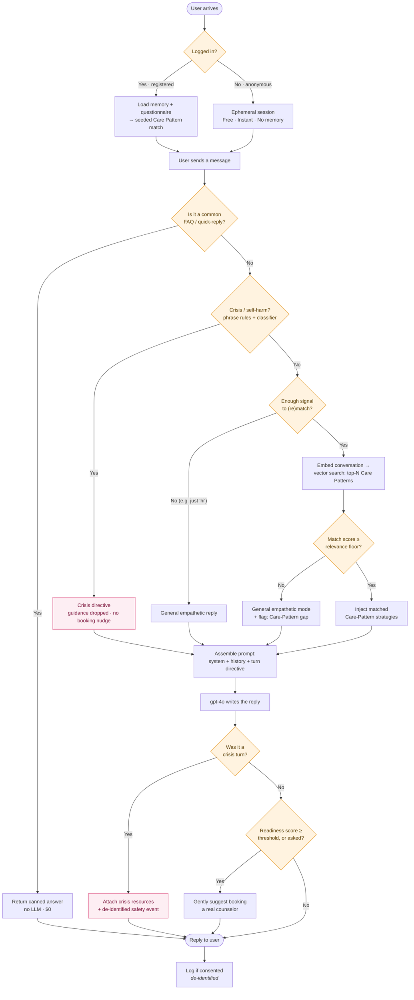
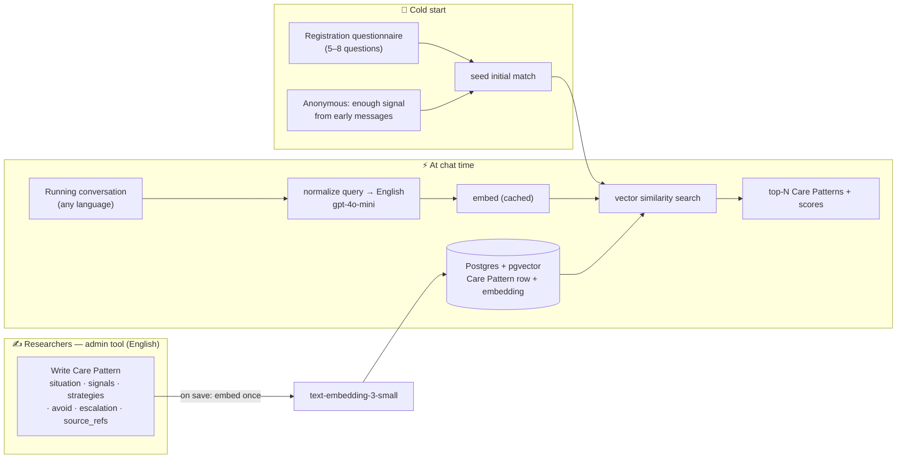

# InnerSun — System Architecture

> **Audience:** Engineers, PMs, and Investors.
> Each diagram is followed by a plain-language explanation and the engineering detail.

InnerSun is an AI psychological-counseling assistant for international students. Our
differentiator is **not** the AI model itself — it is a proprietary knowledge base of
**Care Patterns**: recognized student situations paired with the therapeutic strategy the AI
should use, authored by our human researchers from real clinical cases and grounded in research
literature. The AI *retrieves and applies* this expertise in real time. The AI is the **hook**; the
business goal is to build enough trust that students **book a session with a real human counselor**.

The knowledge base is authored in **English** (one canonical language for researchers and citations),
while the assistant **replies in the student's chosen UI language** — English or 简体中文 today, more
later. See [§3 → Language](#language-english-knowledge-base-replies-in-the-users-language).

### How to read this doc — Lean v1 vs. Future

We ship a **lean v1** first, then grow. Throughout this doc:

- 🟢 **Lean v1** — what we build for launch.
- 🔵 **Future (v2+)** — deferred until we have users, data, and revenue.

In the diagrams, **solid** boxes/arrows are Lean v1; **dashed** boxes/arrows are Future.

---

## 1. The Big Picture (Component Architecture)


<details>
<summary>Diagram source (Mermaid)</summary>



</details>

**Plain language:** The student's browser only ever talks to *our* backend — never directly to
OpenAI. The backend ("orchestrator") is the brain: it figures out what the student needs, looks up
the right researcher-authored guidance (a Care Pattern), asks OpenAI to write a warm reply in that
style, checks it for safety, and decides when to suggest a human counselor. Everything the AI "knows"
lives in our database, which our researchers control. The dashed pieces come later.

**Engineering detail:** The orchestrator is a thin, stateless service (**Node + TypeScript on Fastify**,
settled in PLAN.md Feature 1). Keeping OpenAI
calls behind it gives us **security** (the API key never reaches the browser — today's prototype leaks
it, which we fix in v1), **cost control** (cache, tier models, cap tokens centrally), and **portability**
(the provider sits behind one interface, so "we use OpenAI" is a config choice, not a lock-in).

---

## 2. The Conversation Flow (Login → Counsel → Nudge to a Human)


<details>
<summary>Diagram source (Mermaid)</summary>



</details>

**Plain language:** Anyone can start instantly and anonymously — the "tree hole" promise and top of the
funnel. **Registered** users get their history remembered *and* a head start: the sign-up questionnaire
seeds an initial Care-Pattern match before they type a word. Common questions ("Is this private?") are
answered by pre-written text with no AI call. Every real message is first checked for signs that the
student is in danger; if it finds any, everything else stops and they get crisis resources and a push
toward a real person now, not next week. Otherwise we quietly match the student to researcher cases,
apply that guidance, write a caring reply, and — only when trust is there — mention that a real
counselor is available.

**Engineering detail:** Matching is a *running* assessment. For **anonymous** users we don't match on the
first "hi"; we wait until a message carries enough substance to be worth embedding (a small character
threshold on the student's own text, `CARE_PATTERN_MIN_SIGNAL_CHARS`) and let the **relevance floor**
decide whether to actually apply a pattern. For **registered** users the questionnaire gives a warm start
that the conversation then refines.

**Crisis detection is a separate, higher-priority path** (Feature 9). Two detectors run: a small,
high-precision phrase lexicon in English and Chinese, which is free and cannot be broken by an upstream
outage, and a `gpt-4o-mini` classifier that reads the message in context. A hit from either reroutes the
whole turn — the retrieved Care-Pattern guidance is **dropped rather than blended**, the booking nudge is
suppressed, and the reply is written to a crisis directive instead. The hotline numbers themselves never
pass through a language model: they are appended by the application, because a model asked for a hotline
produces a plausible wrong one. When the lexicon settles the turn, retrieval is not dispatched at all. A
classifier that fails does **not** escalate the turn — failing closed would put hotlines in front of
ordinary conversations on every upstream hiccup — and the failure is logged as a degraded safety layer.

---

## 3. Care Patterns — Storage, Retrieval & Cold-Start (RAG) 🟢


<details>
<summary>Diagram source (Mermaid)</summary>



</details>

**Where Care Patterns live:** **Postgres with the `pgvector` extension.** One managed database holds
*everything* — pattern text, embeddings, users, memory, bookings, and canned answers — with real
transactions and one set of backups. No separate vector database (Pinecone/Qdrant/Weaviate) is needed
at our scale; pgvector handles tens of thousands of patterns comfortably, and we can graduate later
*if* volume ever demands it.

> **Provider: Supabase** (settled 2026-08-15). Local development runs the same thing in Docker via
> the `pgvector/pgvector:pg16` image, and the migrations are plain SQL that port between them
> unchanged. Supabase was already the assumed direction — the schema anticipates reconciling `users`
> with its `auth.users` — so adopting it when the researcher admin tool needed hosting means the
> final deployment inherits the work rather than repeating it. See PLAN.md Features 17 and 21.

**Care Pattern schema (v1):** `id/title` · `situation` (embedded → matching) · `signals` ·
`strategies` (→ prompt) · `avoid` · `escalation` · `source_refs` (research-paper citations) ·
`locale notes` · `status`. Authored in **English** (see Language below).

**Publication is deliberate.** A pattern moves through `draft` → `published` → `retired`, and
**only `published` is ever retrieved**. A newly written pattern is a draft, so authoring one
does not put it in front of students until someone chooses to publish it — the default state
is the harmless one, and forgetting to act leaves a pattern unpublished rather than a
half-finished thought in front of someone in distress. Retiring is a soft withdrawal that
keeps the row, its history and the option to restore it, because clinical guidance that
turned out to be wrong is something you want the record of.

**Cold start (two on-ramps):**
- **Registered → questionnaire.** 5–8 short, warm, mostly multiple-choice questions at sign-up seed
  the initial top-N match on the user's profile. Keep it skippable and low-friction (every question
  costs signups); a mental-health questionnaire is sensitive data, so consent applies.
- **Anonymous → signal-based.** Attempt the first match once early messages carry enough substance;
  the relevance floor decides whether to apply it. (No literal "count 5 keywords" gate — keyword/theme
  extraction is a *signal* into the match, not a hard trigger.)

**Engineering detail:** A pattern's embedding is computed **once**, on save, and stored with the row —
never recomputed at chat time. Adding pattern #200 is a pure content task; no code change. Retrieval is
`ORDER BY embedding <=> :query_vector LIMIT N`.

Two consequences of "once, on save" are worth stating, because both are silent failures rather than
errors. **A pattern with no embedding is invisible to retrieval** — the row looks perfectly healthy in
any table viewer, and nothing anywhere reports that it is unreachable. And **vectors from different
embedding models are not comparable**, so a table holding a mix produces meaningless similarity scores
rather than a complaint. The schema therefore stores provenance next to the vector: which model
produced it, when, and a flag marking a vector that does not currently reflect its `situation` text
(never embedded, or a save whose embedding call failed). A re-embed command sweeps flagged rows, and
the verification script refuses to rank anything while any exist.

### How matching actually works

A common misconception: *the chat model reads the history and "picks" a Care Pattern.* It doesn't — the
match is **vector math**, not the LLM reasoning. The process:

1. **Build a compact match query.** Not all raw history (noisy) — a distilled version: the running
   summary + the student's last few messages, **normalized to English** (see Language below). Two details
   matter more than they look. Only the **student's** messages go in: replaying our own replies would feed
   the guidance we already injected back into the query that selects the guidance, and a pattern would keep
   re-selecting itself as the conversation moved on. And the newest message is **labelled as the newest**, so
   a student who changes the subject is followed rather than out-voted by their own earlier turns.
2. **Embed it.** `text-embedding-3-small` turns that text into a **vector** (~1,536 numbers encoding its
   meaning). Each Care Pattern's `situation` was embedded the same way, once, on save.
3. **Vector search (the match).** pgvector compares the query vector to every Care Pattern vector by
   **cosine similarity** (0 = unrelated, 1 = identical) and returns the **top-N** with scores. No LLM here.
4. **Relevance floor (the gate).** If the top score ≥ threshold → inject/blend those patterns' strategies;
   below → general empathetic mode + flag a Care-Pattern gap.
5. **Repeat** each turn (or every few) as the conversation grows, so the match sharpens or switches.

**When the first attempt happens.** Matching runs on every turn, starting with the student's first
message — but two cheap gates stand in front of it, so anything that is not a situation costs nothing.
Below a small amount of the student's *own* text (their last few messages, `CARE_PATTERN_MIN_SIGNAL_CHARS`,
12 characters by default) the pipeline is skipped entirely, before any upstream call: "hi" cannot match
anything, and the floor would reject it anyway. Past that gate the normalizer itself can answer `NONE` to
small talk, which ends the turn after one cheap call and before any embedding or vector search. So the
first *attempt* is the first message carrying substance, and the first *applied* match is the first turn
whose top score clears the floor — usually not the same turn. This is the "anonymous → signal-based"
on-ramp above, and no keyword counting is involved in it.

**What a turn concludes, and where a gap goes.** Every turn records one of five outcomes: `applied`,
`below_floor`, `no_patterns`, `low_signal`, `failed`. Only `below_floor` raises the **Care-Pattern gap**
flag — a student described something real and the knowledge base had no answer close enough, which is the
signal that says which pattern to author next. A greeting is not a gap, and neither is one of our own
outages: a flag that also fired when the embedding call failed would send the researcher hunting for
content problems that do not exist. Today each turn writes one structured log line carrying the outcome,
the flag, the floor, and the candidate titles with their scores — **never the student's words**. Feature 19
turns that stream into gap analysis; Feature 22's inspector shows the same facts live on the chat page.

**How the floor is decided:** *not* a magic constant, and **not a percentage**. Absolute cosine values depend
on the embedding model *and* on how the patterns happen to be worded, so the floor is **measured**, not chosen:
`npm run retrieval:calibrate` runs labelled cases — messages where one pattern is clearly right, and messages
the library genuinely does not cover — through the real pipeline and prints the band that separates them.

On the Feature 6 starter set with `text-embedding-3-small`, correct matches score **0.61–0.81** and uncovered
messages **0.46 and below**, so the default floor is the midpoint of that gap: **0.54** (`CARE_PATTERN_RELEVANCE_FLOOR`).
Earlier revisions of this document advised starting at ~0.7–0.8; measuring showed that would have rejected
*every* correct match on this library — silently, with every reply still looking perfectly fine. That is the
failure mode this calibration exists to prevent, and the reason the number does not travel between libraries:
re-run the script whenever the pattern set changes materially. If the two bands ever overlap, no threshold
separates them and the fix is the content, not the number.

The `gpt-4o-mini` "assess" step is complementary (extract signals; in the Future *hybrid*
design it re-ranks the vector top-10 by actually reading them) — but the v1 match is embeddings + cosine.

**Seeing a match.** Every step above is invisible by default — a reply arrives and nothing says
which pattern shaped it. The chat page can show all of it (matched patterns and scores, the English
match query, the guidance injected into the prompt, the same message answered again with that
guidance withheld, and — since the cost controls landed — how the prompt was assembled, how much of a
long conversation was summarized rather than resent, and what the turn and the conversation have
cost) behind a **visibility-only credential** that is off unless deliberately switched on. It is
deliberately not the researcher tool's admin session, which can publish and retire clinical guidance.

**The credential is checked when it is entered, and the answer distinguishes the two failures that
need different fixes** — a token this instance does not accept, versus an instance with the
inspector switched off entirely. Unlocking is otherwise client-side, and a wrong credential is
answered with a response identical to an ordinary visitor's, so without that check "the inspector is
off" and "the inspector found nothing" look the same on screen, which is the one thing an
observability surface must never do. See PLAN.md Feature 22.

### Language: English knowledge base, replies in the user's language

- **Knowledge base = English.** Care Patterns, strategies, and the system prompt are authored in English —
  one canonical language, aligned with the research literature, and where models perform best on clinical
  content. Avoids translation drift in the KB.
- **Replies follow the UI toggle.** gpt-4o is multilingual: it reads the English strategies and produces a
  fluent reply in the student's chosen language (English or 简体中文) via a *"respond in {locale}"* instruction.
- **Cross-lingual matching.** A Chinese conversation must still match an English KB. OpenAI embeddings are
  multilingual, but *cross-lingual* recall is weaker — so we **normalize the match query to English** with a
  cheap `gpt-4o-mini` pass before the vector search (English→English retrieval is more reliable). The *reply*
  still goes out in the user's language. **Measured on the starter set:** normalizing raised the top score on
  all 12 match cases, by a mean of **+0.17** — and it lifts correct matches far more than uncovered messages,
  which is precisely what pulls the two bands apart and makes a floor possible at all. The same pass also
  rewrites first-person venting into the third-person situation language the patterns are authored in, so it
  earns its keep on English conversations too, not only on Chinese ones.

### Grounding in research papers

We have research papers and articles. Their role is deliberate:

- ✅ **Primary — papers are the raw material researchers distill into Care Patterns.** A researcher reads the
  literature and encodes the evidence-based strategy in client-friendly language, citing the sources in
  `source_refs`. This keeps every strategy human-vetted, safe, and **traceable to peer-reviewed research** —
  strong for both clinical credibility and the investor story.
- ⚠️ **Avoid — dumping raw paper text into a counseling reply via RAG.** Academic prose is written for
  clinicians, not distressed students; retrieving it raw risks jargon or misapplied findings — a real safety
  issue.
- 🔵 **Future — an internal "research library"** (chunked + embedded papers) as an *authoring/search aid* for
  researchers and to power citations — not a user-facing runtime source.

---

## 4. Pre-Defined Answers (FAQ) — Store, Don't Cache 🟢

Some questions never need an LLM: "Is this confidential?", "How do I book a real counselor?",
"Are you a real person?". These get **pre-written bilingual answers**.

**Caching is the wrong tool here** — a cache stores *expensive computed results* to avoid recomputing
them, but canned answers are *authored constants*: there's nothing to recompute, so nothing to cache.
Just store them directly:

- **v1 — an i18n / config file in the codebase.** Versioned, zero infra, slots into the EN/中文 message
  catalog. Best when engineers own the content.
- **Later — a `canned_responses` DB table.** Move here when researchers/PM need to edit answers *without*
  a code deploy.

**Best UX:** surface them as **clickable quick-reply chips**. Each chip maps deterministically to its
answer — no LLM call, no matching logic, and zero cost.

---

## 5. Cost Control ✅ (Semantic caching → Future)

At ~$0.05 per conversation, unit cost is what matters as we scale. Levers, in order of impact:

| Lever | Status | What it does |
|-------|--------|--------------|
| **Model tiering** | ✅ v1 | `gpt-4o-mini` for classify / safety / summarize / normalize; `gpt-4o` only for the counseling reply. **Biggest lever.** Enforced at startup: the API refuses to boot with both pointed at the same model. |
| **History summarization** | ✅ v1 | Older messages are folded into a running summary instead of being resent, so the prompt stops growing while the conversation stays whole. |
| **Prompt caching** | ✅ v1 | OpenAI bills a prompt prefix it has seen before at half price. Nothing to switch on — what it needs is **ordering**, below. |
| **Token caps + rate limiting** | ✅ v1 | Every call carries a `max_tokens`. Abuse protection so free anonymous usage can't be farmed is Feature 20. |
| **Reply length** | ✅ v1 | The prompt matches reply length to the moment instead of defaulting to long. Measured: completion tokens fell from a 122–219 band to **9–71** on the same messages. |
| **Semantic cache** | 🔵 Future | Skip the model call for repeated *FAQ* questions. Deferred: needs a vector-match service, and it barely helps counseling (real venting is personal, not repeated). **Never** cache a personalized emotional reply. |

> Reference: at 5 users × 1 conversation/day, a week costs ≈ **$1.8 with these optimizations vs ≈ $2.6
> without prompt caching**. The absolute number is tiny at this scale; the point is the **~$0.05/conversation
> unit cost** you multiply as you grow.

### Prompt assembly, and why the order is the cost control

The prompt is built in one function (`services/api/src/prompt.ts`) and always in this order:

```
[system]  static system prompt          ─┐  the same bytes on every request, for every
[system]  running summary, if any        │  student and every language — a stable prefix
[user/assistant]  recent messages       ─┘  that grows only by appending
[system]  turn directive                ─┐  the language note and the Care Pattern guidance
[user]    the message that just arrived ─┘  retrieved for THIS turn — changes every turn
```

OpenAI caches the **longest common prefix** of a prompt, in 128-token increments, once that
prefix passes 1,024 tokens. So anything that varies per turn has to go **last**: the retrieved
guidance reads more naturally near the top, and putting it there would leave no shared prefix
to cache at all. That is the whole reason the static prompt carries no template slots — a single
`{{locale}}` interpolated into it would split the cache by language, invisibly.

The same argument decides how history is replayed. Sending "the newest N messages" bounds the
prompt just as well and is much worse, because the window then slides forward every turn and the
prefix changes immediately after the static prompt — which on its own is ~840 tokens, below the
minimum, so **nothing would ever be cached**. Instead the whole *unsummarized tail* is replayed;
it only ever grows by appending, and a summarization takes it straight back down. Measured on
the real prompt shape: **1,536 of 1,754 prompt tokens served from cache**, about 88%.

**Output is the expensive half.** On `gpt-4o` a completion token costs four times a prompt token, so
the length of a reply is a bigger lever than most prompt-side savings — and it is the one a model
will quietly work against. `max_tokens` caps the worst case and does nothing about a model that
answers "good morning" in a hundred words, which is the default behaviour. Saying so explicitly in
the static prompt — two to five sentences by default, room when a student discloses something
painful, one concrete suggestion rather than a menu — cut completion tokens by roughly two thirds
while a heavy first disclosure still drew a full three paragraphs. It cuts padding, not care.

### What a turn costs, and how that is known

Every upstream call a turn makes is recorded with its model and token counts, priced from a list
in `services/api/src/usage.ts`, and stored as `messages.usage` on the assistant message that turn
produced. A conversation's unit cost is then one query rather than a reconstruction from logs, and
the same breakdown is shown in the Feature 22 inspector. The prices are for observability only —
they live in application code and drift when OpenAI's do; the invoice is authoritative.

---

## 6. Monetization

**Keep the "tree hole" venting free** — it's the brand promise and the top of the funnel. Monetize
*around* it.

| Tier | Price | What they get |
|------|-------|---------------|
| **Anonymous** | Free | Instant AI chat, no memory, rate-limited. The hook. |
| **Registered** | Free | Memory, questionnaire-seeded matching, saved insights, daily allowance. |
| **Subscription** | 🔵 Future, paid | Unlimited AI chat, richer insights, **priority + discounted** human sessions. |
| **Human sessions** | Paid per session | Booking a real counselor — **the core revenue.** |

**Investor framing:** AI chat is deliberately *low-margin lead generation* — which is why the cost levers
in §5 matter. Real revenue is **human session bookings** (high value, recurring). The data flywheel
compounds the moat over time.

---

## 7. Why This Is Defensible (the moat)

- **Proprietary clinical knowledge base.** Competitors are thin prompt-wrappers around the same public
  models; our researcher-authored, case-grounded Care Patterns are content no model has and no
  competitor can copy.
- **Editable & traceable.** Expertise lives in a database (RAG), not baked into model weights
  (fine-tuning), so a researcher corrects one row and it's live instantly — and every reply traces back
  to vetted source material. Critical for clinical responsibility.
- **A compounding data flywheel.** Real (consented, de-identified) conversations reveal which cases to
  author next, so the library grows toward actual demand.

---

## 8. Where Data Science & Big Data Fit

**We do *not* need a predictive, big-data model to do the core matching.** E-commerce recommenders
*predict* hidden intent from **indirect behavior** (clicks, purchases) across millions of users — which
needs big data and suffers cold-start. Our matching is **content-based**: the student *directly discloses*
the problem in words, so matching is *comprehension + routing* against the researcher-authored library.
That works for **user #1** — the researcher knowledge base substitutes for a data-network effect. The
e-commerce-style predictive model maps onto our **Future** collaborative-filtering layer (an
*enhancement*, not the foundation).

So a data scientist adds value in two phases: **v1 = setup + analysis (little/no data)**, which is exactly
what *unlocks* the **Future = trained models (need accumulated data)**.

| # | Opportunity | What it delivers | Data | Model / analysis | Phase |
|---|---|---|---|---|:---:|
| 1 | **Logging + labeling pipeline** | Consented, de-identified capture, structured to be labelable later | none (creates it) | data eng | 🟢 v1 |
| 2 | **Evaluation harness & metrics** | Defines "good match" (precision@k, recall) + benchmark set; tracks quality | small | analysis | 🟢 v1 |
| 3 | **Relevance-floor calibration** | Picks the cosine threshold from labeled data | small | analysis | 🟢 v1 |
| 4 | **Product & funnel analytics** | Volume, languages, issue types, drop-off, AI→booking conversion | minimal | analysis / BI | 🟢 v1 |
| 5 | **Care-Pattern gap analysis** | Finds situations with no good pattern to guide authoring | small | analysis | 🟢 v1 |
| 6 | **Crisis-detection *evaluation*** | Measures recall of the (v1 LLM/rule-based) safety layer | small | analysis | 🟢 v1 |
| 7 | **Re-ranker / cross-encoder** | Trained model on top of retrieval to beat raw cosine | med–large | **trained model** | 🔵 Future |
| 8 | **Fine-tuned domain embeddings** | Better EN↔中文 clinical similarity | large | **trained model** | 🔵 Future |
| 9 | **Crisis/risk classifier (trained)** | Purpose-built safety model, more reliable than LLM-only | medium | **trained model** | 🔵 Future |
| 10 | **Signal extraction** (severity, emotion, topic) | Structured tags to steer matching + nudging | medium | **trained model(s)** | 🔵 Future |
| 11 | **Automated gap clustering** | Cluster unmatched conversations → suggest new patterns | medium | unsupervised ML | 🔵 Future |
| 12 | **Collaborative filtering / recommender** | "Students like this responded well to approach A" (the e-commerce analog) | large | **trained model** | 🔵 Future |
| 13 | **Booking-conversion prediction** | Who's likely to book a human → smarter nudge timing | med–large | **trained model** | 🔵 Future |
| 14 | **Churn / drop-off prediction** | Flags disengaging users for re-engagement | med–large | **trained model** | 🔵 Future |
| 15 | **Strategy-outcome optimization** | A/B tests & bandits on which strategy improves outcomes | large + traffic | experiments + ML | 🔵 Future |
| 16 | **Outcome / efficacy modeling** | Does the product actually help? Clinical-outcome measurement | large + longitudinal | research/stats | 🔵 Future |
| 17 | **Voice/style fine-tuning** | Cheaper small model matches InnerSun tone (knowledge stays in RAG) | large | **trained model** | 🔵 Future |

> **On our medical cases.** Real medical cases are *knowledge data* — great for authoring, an evaluation set,
> and calibration (so a data scientist can start sooner). But they don't train the *predictive* models (those
> need live behavioral data), and — critically — they're **PHI**: de-identify before any pipeline touches them,
> and **never index raw cases for user-facing retrieval**. Safe path: cases → researchers distill →
> de-identified Care Patterns → RAG.

**Sequencing:** don't hire a data scientist at tiny scale — there's no data to train on, and the gating
resource is the Care-Pattern library + users. But build items **1–2 into v1** so clean, labelable data is
waiting. Then a DS starts with evaluation, calibration, and the crisis classifier before graduating to the
trained matching/recommender models. **You are never blocked on ML to launch.**

---

## 9. Future Plan (v2+) 🔵

Deferred until we have users, data, revenue, and governance in place.

- **Semantic caching** — skip the LLM for repeated FAQ-style questions (FAQ only; never personal replies).
- **Collaborative filtering ("wisdom of similar users").** The valuable idea — but the naive version
  ("use user A's replies to answer user B") is unsafe: it would breach A's confidentiality and can be
  *clinically harmful* if A's situation only looks similar. **Safe form:** the learning flows **through the
  Care-Pattern layer**, not peer-to-peer — mine many similar users' *successful* conversations → distill
  de-identified, aggregated patterns → a **researcher vets them** → update the Care Pattern. Separately,
  inferring a new user's likely pattern from similar users is a low-risk **cold-start booster** (vector
  matching over users, not just patterns).
- **Automated flywheel** — auto-cluster low-match conversations and suggest new Care Patterns for
  researchers to author.
- **Voice/style fine-tuning** — after thousands of high-quality conversations, fine-tune a *smaller,
  cheaper* model for tone only (knowledge stays in RAG). A cost optimization, not a foundation.
- **Subscription & payments**, **advanced cross-session memory**, **weighted readiness scoring** for the
  booking nudge.

---

## 10. Hard Constraints (must-haves, not nice-to-haves)

- **Privacy & consent.** Sensitive mental-health data, much of it from Chinese nationals. Anonymous
  logging needs a clear consent notice; using conversations to author Care Patterns needs *separate,
  explicit* consent and **de-identification before any human review**. China's **PIPL** (esp. cross-border
  transfer), **GDPR** for EU students, and special-category-data rules all apply — **legal sign-off is
  required before the flywheel (or collaborative filtering) runs.** Design consent + logging from day one.
- **Safety.** Crisis/self-harm detection with real escalation paths and crisis resources is not optional.
- **Not a medical device.** The AI offers support and coping strategies, never diagnosis — and routes to
  humans for anything beyond its scope.

---

### Appendix — Lean v1 vs. Future at a glance

| Capability | Lean v1 🟢 | Future 🔵 |
|---|:---:|:---:|
| Orchestrator, server-side keys | ✅ | |
| gpt-4o reply + gpt-4o-mini (classify/safety/summarize) | ✅ | |
| Postgres + pgvector, Care-Pattern retrieval + relevance floor | ✅ | |
| Prompt caching, model tiering, summarization | ✅ | |
| English KB + reply in user's language (EN/中文) + English-normalized match query | ✅ | |
| Papers → Care Patterns with `source_refs` citations | ✅ | |
| Hardcoded FAQ / quick-reply chips | ✅ | |
| Registration questionnaire → initial match | ✅ | |
| Signal-based match for anonymous users | ✅ | |
| Safety/crisis + booking nudge (rule-based) + consent/logging | ✅ | |
| DS: logging/labeling pipeline, evaluation harness, relevance-floor calibration, analytics | ✅ | |
| Semantic caching | | 🔵 |
| Collaborative filtering (via Care-Pattern layer) | | 🔵 |
| Automated flywheel, voice fine-tuning | | 🔵 |
| Internal research library (paper RAG for authoring) | | 🔵 |
| DS: trained re-ranker / classifiers / recommender / efficacy models | | 🔵 |
| Subscription/payments, advanced memory, weighted readiness score | | 🔵 |

### Appendix — Reference Stack (proposed)

| Layer | Choice | Why |
|-------|--------|-----|
| Client | React SPA + i18n (EN/中文, extensible) | Existing prototype; more languages later |
| Backend | Node + TypeScript orchestration API (Fastify) | Keeps keys server-side; provider-swappable; one language across FE/BE |
| Models | OpenAI: gpt-4o (reply), gpt-4o-mini (classify/safety/summarize), text-embedding-3-small | Per choice; tiered for cost |
| Storage | Postgres + pgvector — Docker locally, **Supabase** hosted | One store for relational + vectors; cheap, simple; plain-SQL migrations port between the two |
| Authoring | Researcher admin tool served by the API, same origin | Non-engineers write the knowledge base; saving re-embeds automatically |
| Funnel | Scheduling + payments (e.g., Stripe) | Human bookings = revenue |
