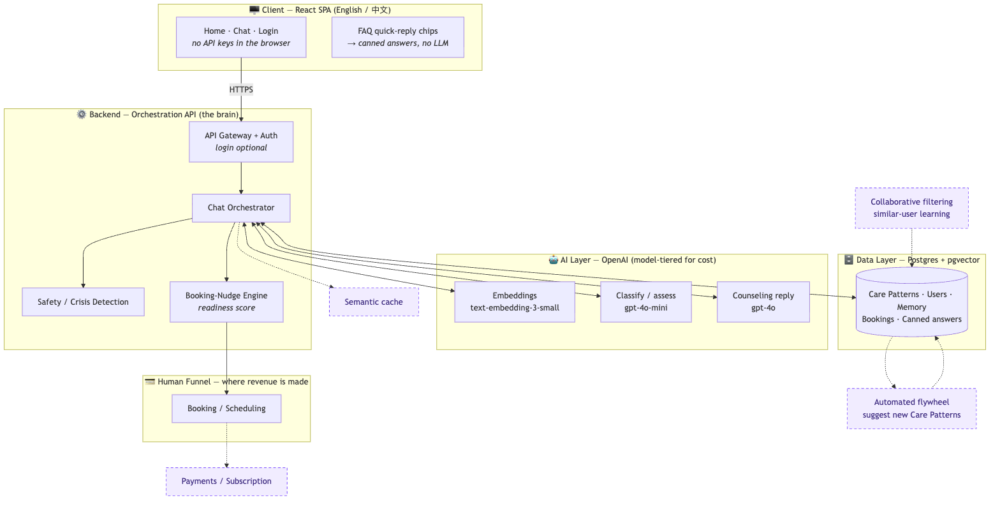
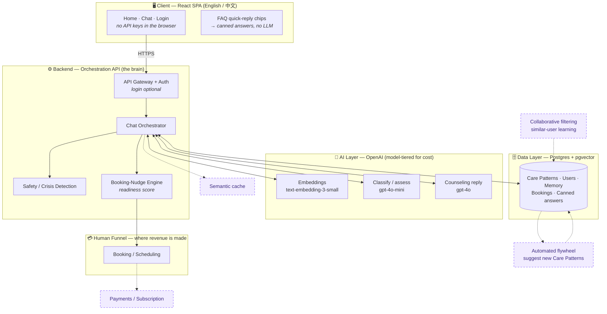
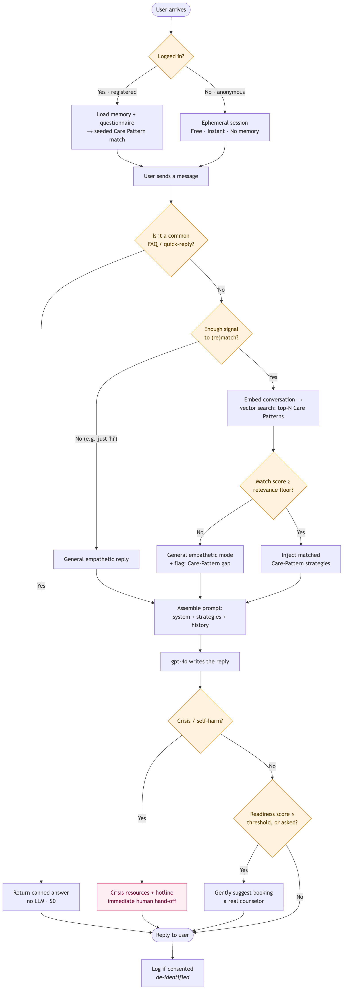
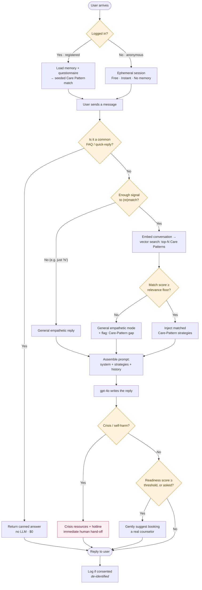
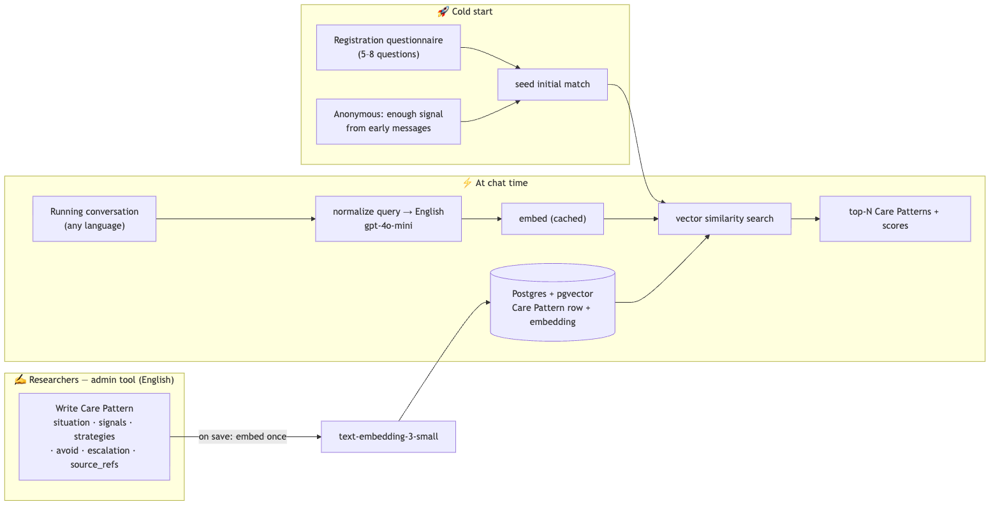
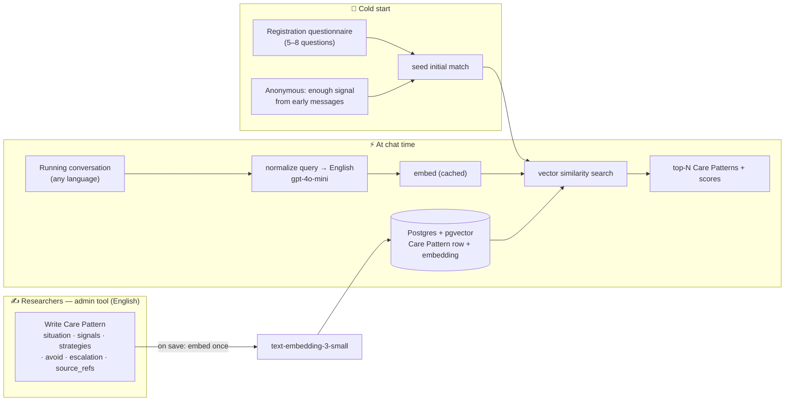

# InnerSun — System Architecture

> **Audience:** Engineers, PMs, and Investors.
> Each diagram is followed by a plain-language explanation and the engineering detail.

InnerSun is an AI psychological-counseling assistant for international students. Our
differentiator is **not** the AI model itself — it is a proprietary knowledge base of
**Care Patterns**: recognized student situations paired with the therapeutic strategy the AI
should use, authored by our human researchers from real clinical cases and grounded in research
literature. The AI *retrieves and applies* this expertise in real time. The AI is the **hook**; the
business goal is to build enough trust that students **book a session with a real human counselor**.

The knowledge base is authored in **English** (one canonical language for researchers and citations),
while the assistant **replies in the student's chosen UI language** — English or 简体中文 today, more
later. See [§3 → Language](#language-english-knowledge-base-replies-in-the-users-language).

### How to read this doc — Lean v1 vs. Future

We ship a **lean v1** first, then grow. Throughout this doc:

- 🟢 **Lean v1** — what we build for launch.
- 🔵 **Future (v2+)** — deferred until we have users, data, and revenue.

In the diagrams, **solid** boxes/arrows are Lean v1; **dashed** boxes/arrows are Future.

---

## 1. The Big Picture (Component Architecture)

Diagram source (Mermaid)

**Plain language:** The student's browser only ever talks to *our* backend — never directly to
OpenAI. The backend ("orchestrator") is the brain: it figures out what the student needs, looks up
the right researcher-authored guidance (a Care Pattern), asks OpenAI to write a warm reply in that
style, checks it for safety, and decides when to suggest a human counselor. Everything the AI "knows"
lives in our database, which our researchers control. The dashed pieces come later.

**Engineering detail:** The orchestrator is a thin, stateless service (Node or Python). Keeping OpenAI
calls behind it gives us **security** (the API key never reaches the browser — today's prototype leaks
it, which we fix in v1), **cost control** (cache, tier models, cap tokens centrally), and **portability**
(the provider sits behind one interface, so "we use OpenAI" is a config choice, not a lock-in).

---

## 2. The Conversation Flow (Login → Counsel → Nudge to a Human)

Diagram source (Mermaid)

**Plain language:** Anyone can start instantly and anonymously — the "tree hole" promise and top of the
funnel. **Registered** users get their history remembered *and* a head start: the sign-up questionnaire
seeds an initial Care-Pattern match before they type a word. Common questions ("Is this private?") are
answered by pre-written text with no AI call. For real messages, we quietly match the student to
researcher cases, apply that guidance, write a caring reply, check it's safe, and — only when trust is
there — mention that a real counselor is available.

**Engineering detail:** Matching is a *running* assessment. For **anonymous** users we don't match on the
first "hi"; we wait until there's enough substance (a couple of substantive messages / a small token
threshold) and let the **relevance floor** decide whether to actually apply a pattern. For **registered**
users the questionnaire gives a warm start that the conversation then refines. Crisis detection is a
separate, higher-priority path — it never routes to "book next week," it surfaces immediate resources.

---

## 3. Care Patterns — Storage, Retrieval & Cold-Start (RAG) 🟢

Diagram source (Mermaid)

**Where Care Patterns live:** **Postgres with the `pgvector` extension.** One managed database
(Supabase / Neon / AWS RDS) holds *everything* — pattern text, embeddings, users, memory, bookings,
and canned answers — with real transactions and one set of backups. No separate vector database
(Pinecone/Qdrant/Weaviate) is needed at our scale; pgvector handles tens of thousands of patterns
comfortably, and we can graduate later *if* volume ever demands it.

**Care Pattern schema (v1):** `id/title` · `situation` (embedded → matching) · `signals` ·
`strategies` (→ prompt) · `avoid` · `escalation` · `source_refs` (research-paper citations) ·
`locale notes`. Authored in **English** (see Language below).

**Cold start (two on-ramps):**
- **Registered → questionnaire.** 5–8 short, warm, mostly multiple-choice questions at sign-up seed
  the initial top-N match on the user's profile. Keep it skippable and low-friction (every question
  costs signups); a mental-health questionnaire is sensitive data, so consent applies.
- **Anonymous → signal-based.** Attempt the first match once early messages carry enough substance;
  the relevance floor decides whether to apply it. (No literal "count 5 keywords" gate — keyword/theme
  extraction is a *signal* into the match, not a hard trigger.)

**Engineering detail:** A pattern's embedding is computed **once**, on save, and stored with the row —
never recomputed at chat time. Adding pattern #200 is a pure content task; no code change. Retrieval is
`ORDER BY embedding <=> :query_vector LIMIT N`.

### How matching actually works

A common misconception: *the chat model reads the history and "picks" a Care Pattern.* It doesn't — the
match is **vector math**, not the LLM reasoning. The process:

1. **Build a compact match query.** Not all raw history (noisy) — a distilled version: the running
   summary + the last few messages, **normalized to English** (see Language below).
2. **Embed it.** `text-embedding-3-small` turns that text into a **vector** (~1,536 numbers encoding its
   meaning). Each Care Pattern's `situation` was embedded the same way, once, on save.
3. **Vector search (the match).** pgvector compares the query vector to every Care Pattern vector by
   **cosine similarity** (0 = unrelated, 1 = identical) and returns the **top-N** with scores. No LLM here.
4. **Relevance floor (the gate).** If the top score ≥ threshold → inject/blend those patterns' strategies;
   below → general empathetic mode + flag a Care-Pattern gap.
5. **Repeat** each turn (or every few) as the conversation grows, so the match sharpens or switches.

**How the floor is decided:** *not* a magic constant. Absolute cosine values are **embedding-model-specific**,
so calibrate on data — have researchers label the correct pattern on example conversations, then pick the
threshold that best separates good from bad matches (precision/recall). Start ~0.7–0.8 and tune from
production logs. The `gpt-4o-mini` "assess" step is complementary (extract signals; in the Future *hybrid*
design it re-ranks the vector top-10 by actually reading them) — but the v1 match is embeddings + cosine.

### Language: English knowledge base, replies in the user's language

- **Knowledge base = English.** Care Patterns, strategies, and the system prompt are authored in English —
  one canonical language, aligned with the research literature, and where models perform best on clinical
  content. Avoids translation drift in the KB.
- **Replies follow the UI toggle.** gpt-4o is multilingual: it reads the English strategies and produces a
  fluent reply in the student's chosen language (English or 简体中文) via a *"respond in {locale}"* instruction.
- **Cross-lingual matching.** A Chinese conversation must still match an English KB. OpenAI embeddings are
  multilingual, but *cross-lingual* recall is weaker — so we **normalize the match query to English** with a
  cheap `gpt-4o-mini` pass before the vector search (English→English retrieval is more reliable). The *reply*
  still goes out in the user's language.

### Grounding in research papers

We have research papers and articles. Their role is deliberate:

- ✅ **Primary — papers are the raw material researchers distill into Care Patterns.** A researcher reads the
  literature and encodes the evidence-based strategy in client-friendly language, citing the sources in
  `source_refs`. This keeps every strategy human-vetted, safe, and **traceable to peer-reviewed research** —
  strong for both clinical credibility and the investor story.
- ⚠️ **Avoid — dumping raw paper text into a counseling reply via RAG.** Academic prose is written for
  clinicians, not distressed students; retrieving it raw risks jargon or misapplied findings — a real safety
  issue.
- 🔵 **Future — an internal "research library"** (chunked + embedded papers) as an *authoring/search aid* for
  researchers and to power citations — not a user-facing runtime source.

---

## 4. Pre-Defined Answers (FAQ) — Store, Don't Cache 🟢

Some questions never need an LLM: "Is this confidential?", "How do I book a real counselor?",
"Are you a real person?". These get **pre-written bilingual answers**.

**Caching is the wrong tool here** — a cache stores *expensive computed results* to avoid recomputing
them, but canned answers are *authored constants*: there's nothing to recompute, so nothing to cache.
Just store them directly:

- **v1 — an i18n / config file in the codebase.** Versioned, zero infra, slots into the EN/中文 message
  catalog. Best when engineers own the content.
- **Later — a `canned_responses` DB table.** Move here when researchers/PM need to edit answers *without*
  a code deploy.

**Best UX:** surface them as **clickable quick-reply chips**. Each chip maps deterministically to its
answer — no LLM call, no matching logic, and zero cost.

---

## 5. Cost Control 🟢 (Semantic caching → Future)

At ~$0.05 per conversation, unit cost is what matters as we scale. Levers, in order of impact:

| Lever | Status | What it does |
|-------|--------|--------------|
| **Model tiering** | 🟢 v1 | `gpt-4o-mini` for classify / safety / summarize; `gpt-4o` only for the counseling reply. **Biggest lever.** |
| **History summarization** | 🟢 v1 | Summarize older turns instead of resending them; keeps prompts short (full history grows quadratically). |
| **Prompt caching** | 🟢 v1 | OpenAI bills the unchanged system-prompt prefix at a discount. Nearly free to enable, so it stays in v1. |
| **Token caps + rate limiting** | 🟢 v1 | Bounded `max_tokens`; abuse protection so free anonymous usage can't be farmed. |
| **Semantic cache** | 🔵 Future | Skip the model call for repeated *FAQ* questions. Deferred: needs a vector-match service, and it barely helps counseling (real venting is personal, not repeated). **Never** cache a personalized emotional reply. |

> Reference: at 5 users × 1 conversation/day, a week costs ≈ **$1.8 with these optimizations vs ≈ $2.6
> without prompt caching**. The absolute number is tiny at this scale; the point is the **~$0.05/conversation
> unit cost** you multiply as you grow.

---

## 6. Monetization

**Keep the "tree hole" venting free** — it's the brand promise and the top of the funnel. Monetize
*around* it.

| Tier | Price | What they get |
|------|-------|---------------|
| **Anonymous** | Free | Instant AI chat, no memory, rate-limited. The hook. |
| **Registered** | Free | Memory, questionnaire-seeded matching, saved insights, daily allowance. |
| **Subscription** | 🔵 Future, paid | Unlimited AI chat, richer insights, **priority + discounted** human sessions. |
| **Human sessions** | Paid per session | Booking a real counselor — **the core revenue.** |

**Investor framing:** AI chat is deliberately *low-margin lead generation* — which is why the cost levers
in §5 matter. Real revenue is **human session bookings** (high value, recurring). The data flywheel
compounds the moat over time.

---

## 7. Why This Is Defensible (the moat)

- **Proprietary clinical knowledge base.** Competitors are thin prompt-wrappers around the same public
  models; our researcher-authored, case-grounded Care Patterns are content no model has and no
  competitor can copy.
- **Editable & traceable.** Expertise lives in a database (RAG), not baked into model weights
  (fine-tuning), so a researcher corrects one row and it's live instantly — and every reply traces back
  to vetted source material. Critical for clinical responsibility.
- **A compounding data flywheel.** Real (consented, de-identified) conversations reveal which cases to
  author next, so the library grows toward actual demand.

---

## 8. Where Data Science & Big Data Fit

**We do *not* need a predictive, big-data model to do the core matching.** E-commerce recommenders
*predict* hidden intent from **indirect behavior** (clicks, purchases) across millions of users — which
needs big data and suffers cold-start. Our matching is **content-based**: the student *directly discloses*
the problem in words, so matching is *comprehension + routing* against the researcher-authored library.
That works for **user #1** — the researcher knowledge base substitutes for a data-network effect. The
e-commerce-style predictive model maps onto our **Future** collaborative-filtering layer (an
*enhancement*, not the foundation).

So a data scientist adds value in two phases: **v1 = setup + analysis (little/no data)**, which is exactly
what *unlocks* the **Future = trained models (need accumulated data)**.

| # | Opportunity | What it delivers | Data | Model / analysis | Phase |
|---|---|---|---|---|:---:|
| 1 | **Logging + labeling pipeline** | Consented, de-identified capture, structured to be labelable later | none (creates it) | data eng | 🟢 v1 |
| 2 | **Evaluation harness & metrics** | Defines "good match" (precision@k, recall) + benchmark set; tracks quality | small | analysis | 🟢 v1 |
| 3 | **Relevance-floor calibration** | Picks the cosine threshold from labeled data | small | analysis | 🟢 v1 |
| 4 | **Product & funnel analytics** | Volume, languages, issue types, drop-off, AI→booking conversion | minimal | analysis / BI | 🟢 v1 |
| 5 | **Care-Pattern gap analysis** | Finds situations with no good pattern to guide authoring | small | analysis | 🟢 v1 |
| 6 | **Crisis-detection *evaluation*** | Measures recall of the (v1 LLM/rule-based) safety layer | small | analysis | 🟢 v1 |
| 7 | **Re-ranker / cross-encoder** | Trained model on top of retrieval to beat raw cosine | med–large | **trained model** | 🔵 Future |
| 8 | **Fine-tuned domain embeddings** | Better EN↔中文 clinical similarity | large | **trained model** | 🔵 Future |
| 9 | **Crisis/risk classifier (trained)** | Purpose-built safety model, more reliable than LLM-only | medium | **trained model** | 🔵 Future |
| 10 | **Signal extraction** (severity, emotion, topic) | Structured tags to steer matching + nudging | medium | **trained model(s)** | 🔵 Future |
| 11 | **Automated gap clustering** | Cluster unmatched conversations → suggest new patterns | medium | unsupervised ML | 🔵 Future |
| 12 | **Collaborative filtering / recommender** | "Students like this responded well to approach A" (the e-commerce analog) | large | **trained model** | 🔵 Future |
| 13 | **Booking-conversion prediction** | Who's likely to book a human → smarter nudge timing | med–large | **trained model** | 🔵 Future |
| 14 | **Churn / drop-off prediction** | Flags disengaging users for re-engagement | med–large | **trained model** | 🔵 Future |
| 15 | **Strategy-outcome optimization** | A/B tests & bandits on which strategy improves outcomes | large + traffic | experiments + ML | 🔵 Future |
| 16 | **Outcome / efficacy modeling** | Does the product actually help? Clinical-outcome measurement | large + longitudinal | research/stats | 🔵 Future |
| 17 | **Voice/style fine-tuning** | Cheaper small model matches InnerSun tone (knowledge stays in RAG) | large | **trained model** | 🔵 Future |

**Sequencing:** don't hire a data scientist at tiny scale — there's no data to train on, and the gating
resource is the Care-Pattern library + users. But build items **1–2 into v1** so clean, labelable data is
waiting. Then a DS starts with evaluation, calibration, and the crisis classifier before graduating to the
trained matching/recommender models. **You are never blocked on ML to launch.**

---

## 9. Future Plan (v2+) 🔵

Deferred until we have users, data, revenue, and governance in place.

- **Semantic caching** — skip the LLM for repeated FAQ-style questions (FAQ only; never personal replies).
- **Collaborative filtering ("wisdom of similar users").** The valuable idea — but the naive version
  ("use user A's replies to answer user B") is unsafe: it would breach A's confidentiality and can be
  *clinically harmful* if A's situation only looks similar. **Safe form:** the learning flows **through the
  Care-Pattern layer**, not peer-to-peer — mine many similar users' *successful* conversations → distill
  de-identified, aggregated patterns → a **researcher vets them** → update the Care Pattern. Separately,
  inferring a new user's likely pattern from similar users is a low-risk **cold-start booster** (vector
  matching over users, not just patterns).
- **Automated flywheel** — auto-cluster low-match conversations and suggest new Care Patterns for
  researchers to author.
- **Voice/style fine-tuning** — after thousands of high-quality conversations, fine-tune a *smaller,
  cheaper* model for tone only (knowledge stays in RAG). A cost optimization, not a foundation.
- **Subscription & payments**, **advanced cross-session memory**, **weighted readiness scoring** for the
  booking nudge.

---

## 10. Hard Constraints (must-haves, not nice-to-haves)

- **Privacy & consent.** Sensitive mental-health data, much of it from Chinese nationals. Anonymous
  logging needs a clear consent notice; using conversations to author Care Patterns needs *separate,
  explicit* consent and **de-identification before any human review**. China's **PIPL** (esp. cross-border
  transfer), **GDPR** for EU students, and special-category-data rules all apply — **legal sign-off is
  required before the flywheel (or collaborative filtering) runs.** Design consent + logging from day one.
- **Safety.** Crisis/self-harm detection with real escalation paths and crisis resources is not optional.
- **Not a medical device.** The AI offers support and coping strategies, never diagnosis — and routes to
  humans for anything beyond its scope.

---

### Appendix — Lean v1 vs. Future at a glance

| Capability | Lean v1 🟢 | Future 🔵 |
|---|:---:|:---:|
| Orchestrator, server-side keys | ✅ | |
| gpt-4o reply + gpt-4o-mini (classify/safety/summarize) | ✅ | |
| Postgres + pgvector, Care-Pattern retrieval + relevance floor | ✅ | |
| Prompt caching, model tiering, summarization | ✅ | |
| English KB + reply in user's language (EN/中文) + English-normalized match query | ✅ | |
| Papers → Care Patterns with `source_refs` citations | ✅ | |
| Hardcoded FAQ / quick-reply chips | ✅ | |
| Registration questionnaire → initial match | ✅ | |
| Signal-based match for anonymous users | ✅ | |
| Safety/crisis + booking nudge (rule-based) + consent/logging | ✅ | |
| DS: logging/labeling pipeline, evaluation harness, relevance-floor calibration, analytics | ✅ | |
| Semantic caching | | 🔵 |
| Collaborative filtering (via Care-Pattern layer) | | 🔵 |
| Automated flywheel, voice fine-tuning | | 🔵 |
| Internal research library (paper RAG for authoring) | | 🔵 |
| DS: trained re-ranker / classifiers / recommender / efficacy models | | 🔵 |
| Subscription/payments, advanced memory, weighted readiness score | | 🔵 |

### Appendix — Reference Stack (proposed)

| Layer | Choice | Why |
|-------|--------|-----|
| Client | React SPA + i18n (EN/中文, extensible) | Existing prototype; more languages later |
| Backend | Node or Python orchestration API | Keeps keys server-side; provider-swappable |
| Models | OpenAI: gpt-4o (reply), gpt-4o-mini (classify/safety/summarize), text-embedding-3-small | Per choice; tiered for cost |
| Storage | Postgres + pgvector | One store for relational + vectors; cheap, simple |
| Funnel | Scheduling + payments (e.g., Stripe) | Human bookings = revenue |
